# PA1 — Programación Avanzada de Base de Datos (30627)

## Proyecto: Sistema de ventas **TechStore Perú**

**Evaluación:** PA1 — Proceso de Aprendizaje 1  
**Curso:** Programación Avanzada de Base de Datos  
**Código:** 30627  
**Institución:** ISIL  
**Integrante:** Anthony Fernando Alcántara Valencia  
**Rol:** Análisis, modelado, implementación SQL, pruebas, consultas y documentación.

> **Video público de YouTube:** [PEGAR AQUÍ EL ENLACE]

---

## 1. Descripción del problema

TechStore Perú necesita administrar información de clientes, categorías, productos y ventas en una base de datos Microsoft SQL Server. La solución debe preservar la integridad de los datos y permitir obtener información operativa útil mediante consultas SQL.

El proyecto implementa un modelo físico relacional y demuestra el uso de:

- DDL y DML.
- `PRIMARY KEY`, `FOREIGN KEY`, `DEFAULT`, `UNIQUE` y `CHECK`.
- `INSERT`.
- `SELECT`, `WHERE`, `LIKE`, `BETWEEN`, `IN` y `EXISTS`.
- Funciones de cadena, numéricas y de fecha.
- `GROUP BY`, `HAVING` y funciones de agregación.
- `INNER JOIN`, `LEFT JOIN` y `RIGHT JOIN`.
- `CASE`.
- `UNION`.
- Creación de tabla desde consulta mediante `SELECT INTO`.
- Subconsultas y `EXISTS`.

---

## 2. Objetivo

Diseñar e implementar una base de datos física en Microsoft SQL Server que permita registrar y consultar las operaciones comerciales de TechStore Perú, garantizando integridad referencial y aplicando los contenidos desarrollados hasta la sesión 4.

---

## 3. Arquitectura cliente/servidor aplicada

La solución usa una arquitectura cliente/servidor:

- **Cliente:** SQL Server Management Studio (SSMS).
- **Servidor:** instancia de Microsoft SQL Server.
- **Base de datos:** `PA1_TechStore`.
- **Comunicación:** SSMS envía instrucciones T-SQL al motor SQL Server y recibe resultados.
- **Responsabilidad del servidor:** almacenamiento, validación de restricciones, ejecución de consultas y mantenimiento de la integridad.

---

## 4. Modelo físico

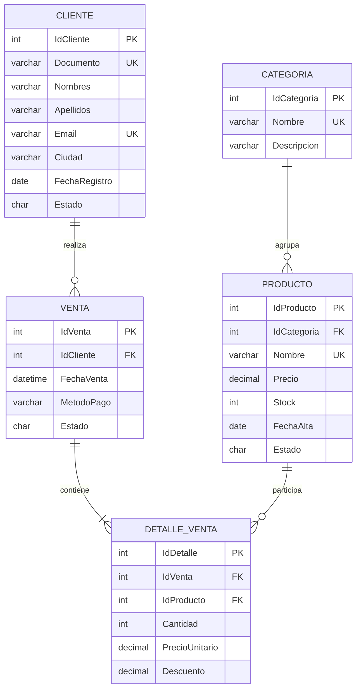

---

## 5. Estructura del repositorio

```text
PA1_30627_Anthony_Alcantara/
├─ README.md
├─ sql/
│  ├─ 00_ejecutar_todo.sql
│  ├─ 01_base_y_modelo.sql
│  ├─ 02_datos.sql
│  ├─ 03_consultas.sql
│  └─ 04_validaciones.sql
└─ docs/
   ├─ modelo_fisico.md
   ├─ video_exposicion.md
   └─ evidencias/
      └─ README.md
```

---

## 6. Desarrollo y decisiones técnicas

### 6.1 Entidades

Se definieron cinco tablas:

1. `Cliente`: información de compradores.
2. `Categoria`: clasificación de productos.
3. `Producto`: catálogo con precio y stock.
4. `Venta`: cabecera de cada operación.
5. `DetalleVenta`: productos incluidos en cada venta.

### 6.2 Restricciones utilizadas

- `PRIMARY KEY`: identifica de manera única cada registro.
- `FOREIGN KEY`: mantiene relaciones válidas entre tablas.
- `UNIQUE`: evita duplicados en documento, correo, categoría y nombre de producto.
- `DEFAULT`: asigna valores predeterminados para fechas y estados.
- `CHECK`: valida precio, stock, cantidad, descuento, método de pago y estados permitidos.

### 6.3 Datos de prueba

Se insertan clientes de Lima, Ica y Arequipa; categorías de productos; catálogo; ventas y detalles. Los datos fueron diseñados para permitir comprobar filtros, agrupaciones, JOIN, CASE, UNION, subconsultas y EXISTS.

---

## 7. Solución propuesta

### Script 01 — Modelo físico

`sql/01_base_y_modelo.sql`

Crea la base de datos y las tablas con sus tipos de datos, claves y restricciones.

### Script 02 — Datos

`sql/02_datos.sql`

Registra información válida mediante `INSERT`.

### Script 03 — Consultas

`sql/03_consultas.sql`

Incluye ejemplos documentados de selección, filtros, funciones, agrupación, JOIN, CASE, UNION, subconsultas y EXISTS.

### Script 04 — Validaciones

`sql/04_validaciones.sql`

Ejecuta pruebas controladas para evidenciar que las restricciones rechazan datos inválidos sin dejar registros incorrectos.

### Script 05 — Separación y adjunción

`sql/05_detach_attach.sql`

Incluye consulta de rutas, `sp_detach_db` y un ejemplo documentado de `CREATE DATABASE ... FOR ATTACH` para cubrir el contenido de separación y adjunción de la sesión 1.

### Script completo

`sql/00_ejecutar_todo.sql`

Contiene toda la solución en un solo archivo para facilitar la revisión.

---

## 8. Cómo ejecutar o revisar el proyecto

### Requisitos

- Microsoft SQL Server 2019 o superior.
- SQL Server Management Studio (SSMS).
- Permisos para crear una base de datos local.

### Orden recomendado

1. Abrir SSMS y conectarse a SQL Server.
2. Ejecutar `sql/01_base_y_modelo.sql`.
3. Ejecutar `sql/02_datos.sql`.
4. Ejecutar `sql/03_consultas.sql`.
5. Ejecutar `sql/04_validaciones.sql`.

Alternativamente, ejecutar `sql/00_ejecutar_todo.sql`.

### Evidencias sugeridas

Tomar capturas de:

- Base `PA1_TechStore` creada.
- Diagrama o relaciones entre tablas.
- Registros insertados.
- Resultado de consultas con filtros.
- Resultado de `GROUP BY` y `HAVING`.
- Resultado de `INNER JOIN` y `LEFT JOIN`.
- Resultado de `CASE`.
- Resultado de `UNION`.
- Resultado de subconsulta.
- Resultado de `EXISTS`.
- Mensajes de validación de restricciones.

Guardar las capturas en `docs/evidencias/`.

La carpeta `resultados/` contiene salidas de consulta asociadas al conjunto de datos del proyecto. Las capturas de ejecución se incorporan en `docs/evidencias/` después de ejecutar el proyecto en SSMS.

---


### Evidencias visuales incluidas

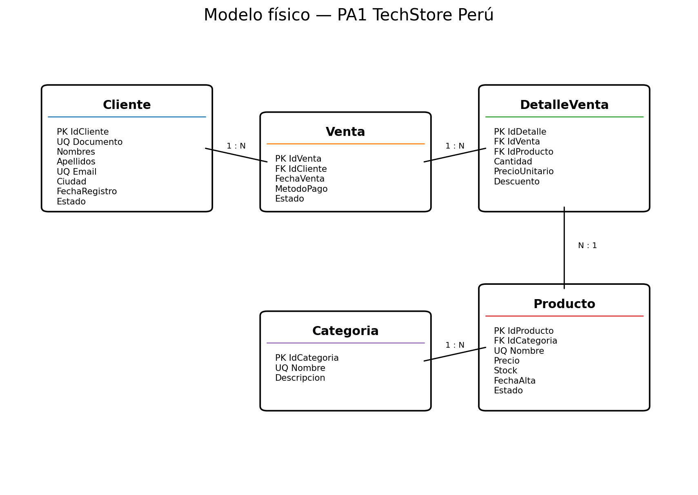

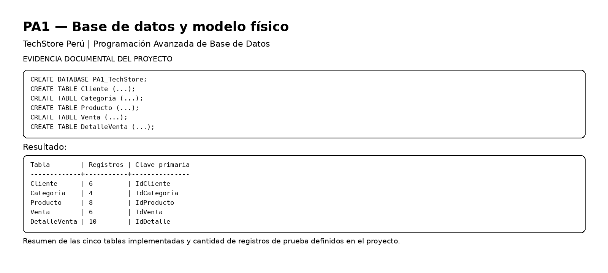

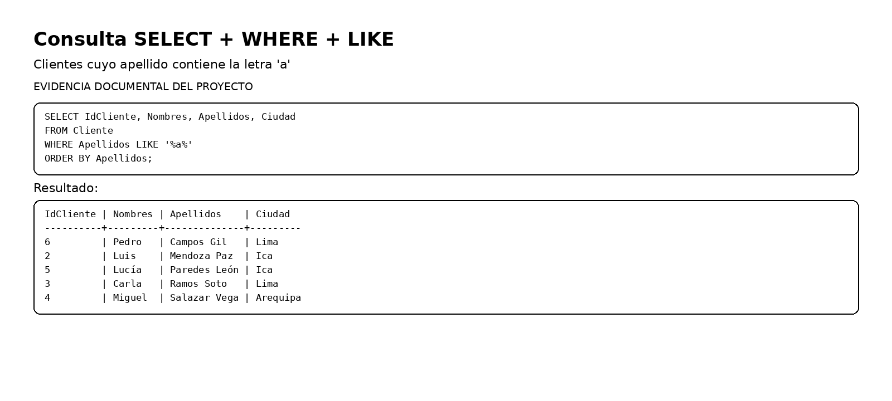

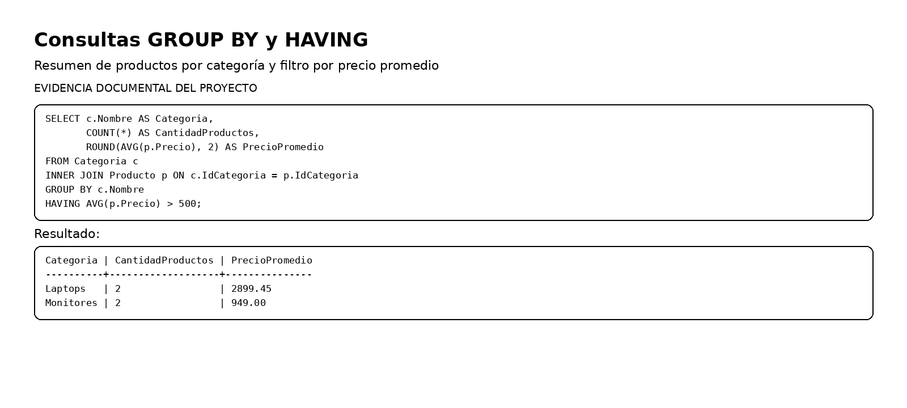

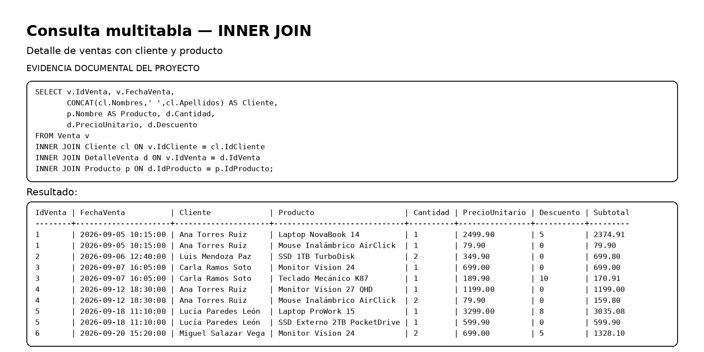

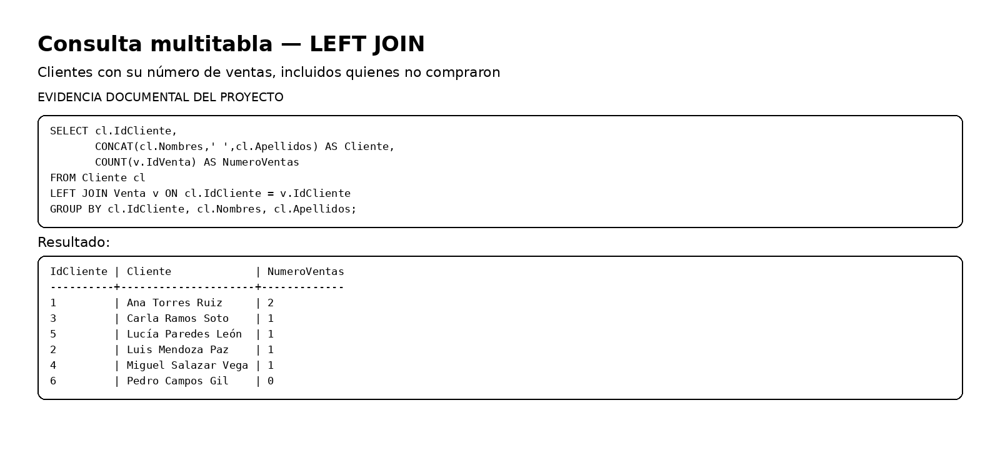

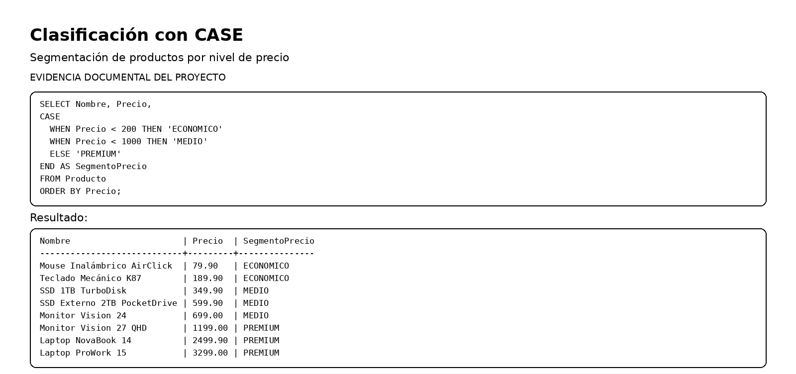

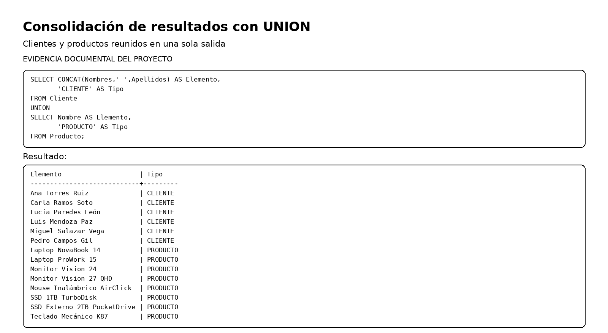

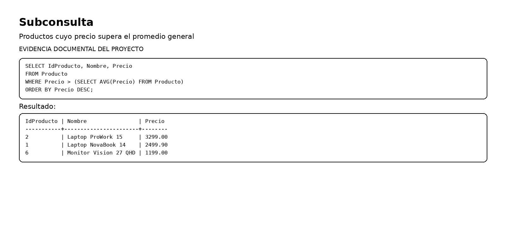

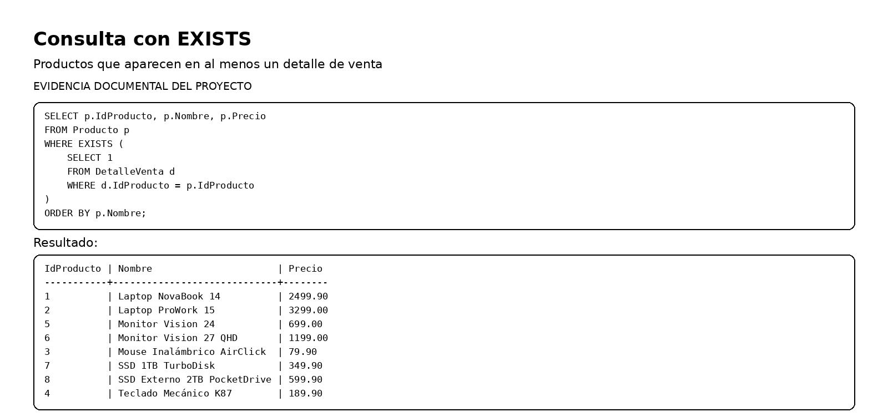

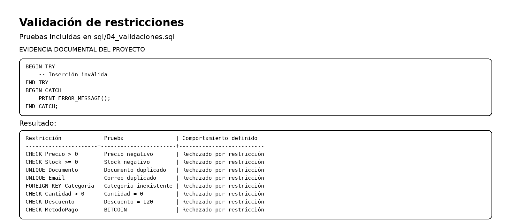

## 9. Consultas implementadas

El archivo `03_consultas.sql` contiene, entre otras:

1. `WHERE` + `LIKE`.
2. `BETWEEN`.
3. `IN`.
4. Funciones de cadena.
5. Funciones numéricas.
6. Funciones de fecha.
7. Agregaciones con `GROUP BY`.
8. Filtro de grupos con `HAVING`.
9. `INNER JOIN`.
10. `LEFT JOIN`.
11. `RIGHT JOIN`.
12. `CASE`.
13. `UNION`.
14. `SELECT INTO`.
15. Subconsulta escalar.
16. Subconsulta con `IN`.
17. Consulta con `EXISTS`.

---

## 10. Evidencias de integridad

El proyecto demuestra que SQL Server impide, entre otros casos:

- Precio negativo.
- Stock negativo.
- Documento duplicado.
- Correo duplicado.
- Cantidad de venta igual o menor que cero.
- Descuento fuera del rango permitido.
- Métodos de pago no definidos.
- Claves foráneas inexistentes.

Las pruebas se realizan con `TRY...CATCH` y transacciones para evitar alterar los datos válidos.

---

## 11. Conclusiones

1. El modelo físico permite representar de forma coherente clientes, productos y operaciones de venta.
2. Las restricciones de integridad reducen el riesgo de registros inconsistentes.
3. Las consultas con filtros, funciones y agrupaciones permiten convertir datos operativos en información útil.
4. Los JOIN permiten integrar información distribuida entre varias tablas relacionadas.
5. Las subconsultas y `EXISTS` permiten resolver requerimientos dependientes de información obtenida mediante otras consultas.
6. La estructura del repositorio facilita la revisión y reproducción de la solución.

---

## 11. Galería visual de demostración

La siguiente galería resume de forma visual las principales etapas del proyecto.

| Modelo y datos | Consultas básicas |
|---|---|
|  |  |
|  |  |

| Agrupación y JOIN | Lógica y consolidación |
|---|---|
|  |  |
|  |  |
|  |  |

| EXISTS | Validaciones |
|---|---|
|  |  |

> Las imágenes anteriores son material visual de demostración. Las capturas de ejecución real en SSMS deben añadirse por separado si el docente las solicita como evidencia de ejecución.

## 12. Video de exposición

**Video público de YouTube:** [PEGAR AQUÍ EL ENLACE]

Los requisitos y el orden de exposición se encuentran en `docs/video_exposicion.md`.
