# Capturas de demostración

Estas imágenes presentan visualmente el flujo del proyecto en una interfaz inspirada en SQL Server Management Studio.

## Galería

### 1. Creación de la base de datos
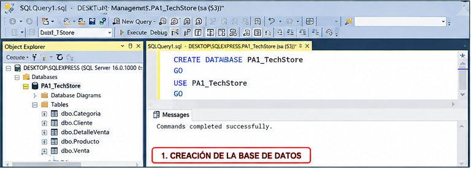

### 2. Tablas y datos
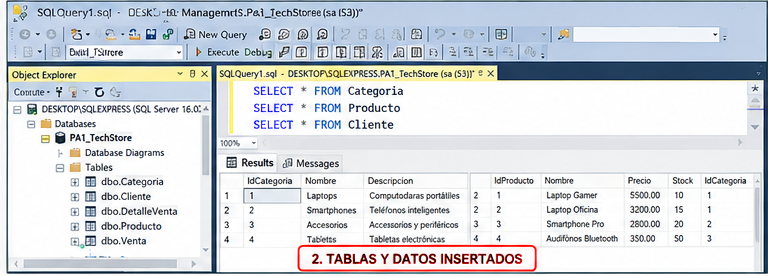

### 3. WHERE y LIKE
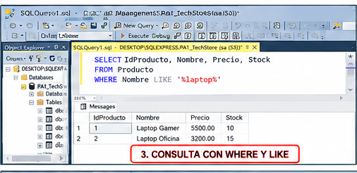

### 4. BETWEEN e IN
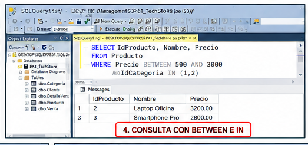

### 5. GROUP BY y HAVING
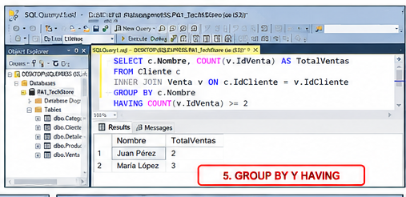

### 6. INNER JOIN
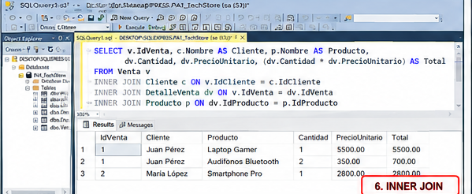

### 7. LEFT JOIN
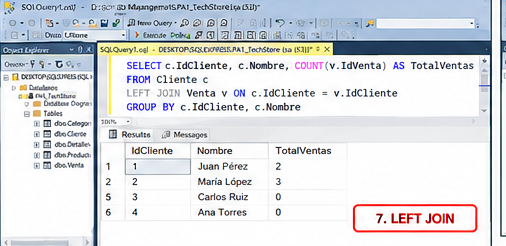

### 8. CASE
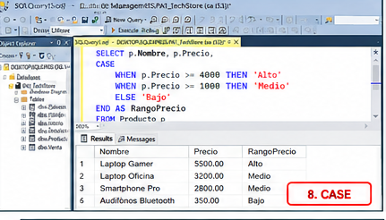

### 9. UNION
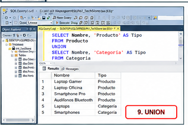

### 10. Subconsulta
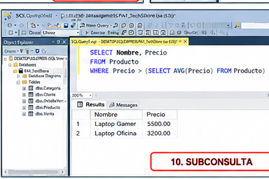

### 11. EXISTS
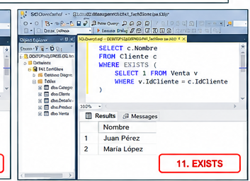

### 12. Validaciones y restricciones
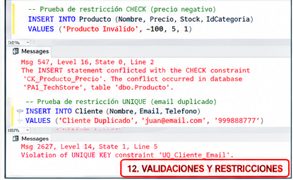

> Nota: estas imágenes son material visual de demostración. Para acreditar una ejecución real en Microsoft SQL Server Management Studio, deben añadirse capturas obtenidas directamente de SSMS.
